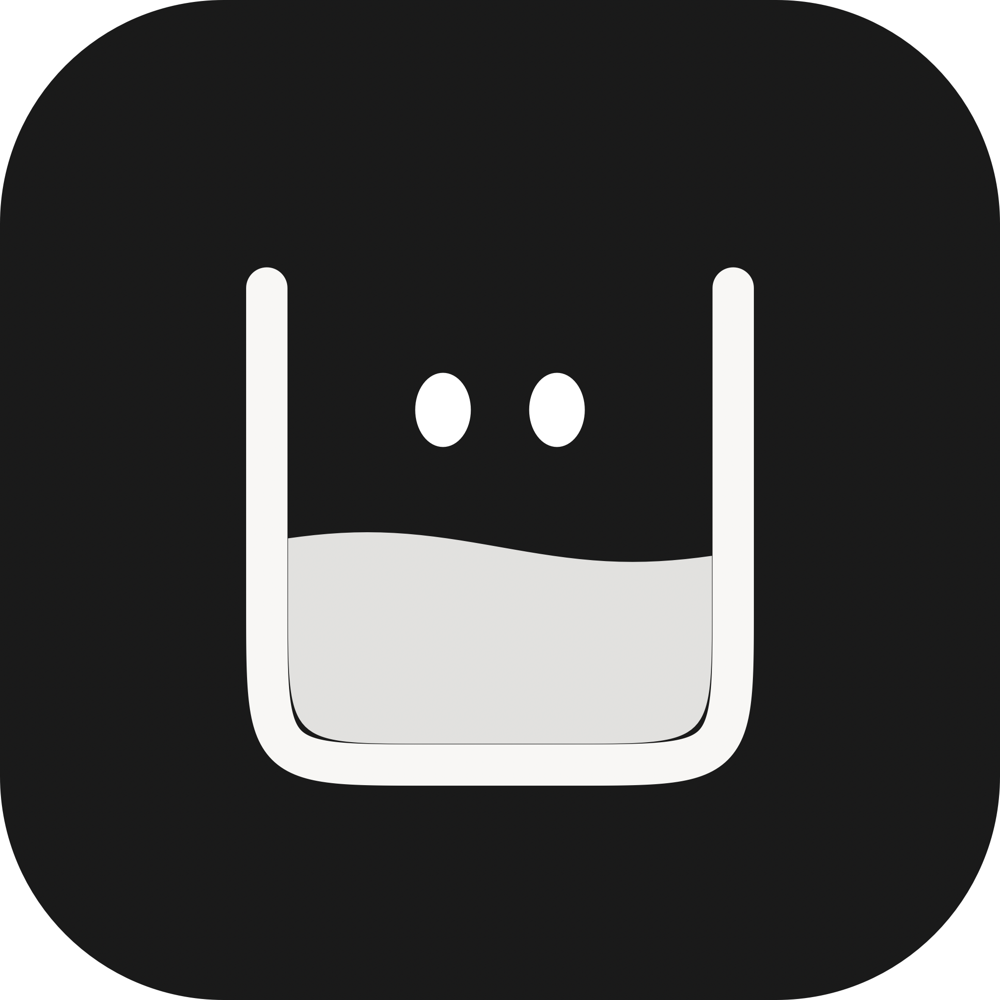

<div align="center">


# Tidemark

**Know your headroom.**

A calm macOS menu-bar companion for AI usage windows — how much is left, when it
resets *in your timezone*, and whether it is safe to keep going.

</div>

---

## Run it

Requires macOS 13+ and Xcode Command Line Tools.

```bash
git clone https://github.com/edenbuilds/tidemark.git && cd tidemark
./build-app.sh && open Tidemark.app
```

Or from source, without a bundle:

```bash
swift run
```

```bash
swift test
```

> `swift run` has no app bundle, so **launch-at-login and notifications are
> unavailable** in that mode. Use `./build-app.sh` for the full app.

## Finding it

Tidemark is an accessory app — no Dock icon. It lives in the **menu bar**, and
its glyph fills up as you use your window.

| Action | How |
|--------|-----|
| Show / hide the panel | Click the menu-bar mark |
| Menu (refresh, minimise, settings, quit) | Right-click the menu-bar mark |
| Minimise to compact | `Esc`, or the `–` button |
| Hide entirely | `⌘W`, or the `✕` button — reopen from the menu bar |
| Refresh | `⌘R` |
| Switch tabs | `⌘1` `⌘2` `⌘3` |
| Preferences | `⌘,` |
| Move it | Drag the header — it snaps to the nearest edge |

Collapsed with auto-hide on, it becomes a **7pt rail on the screen edge**, filled
to your usage level. Hover to peek, click to open.

## What is real, and what is not

This is the part worth reading.

| Shown | Status |
|-------|--------|
| Recent sessions, daily message counts | **Measured.** Read from files the Codex and Claude Code CLIs already wrote on this Mac. |
| Usage percentage (local source) | **Estimated.** No local file publishes your plan's limits, so this is *your activity this window against your own busiest window* — a proxy, labelled as one. |
| Cost | **Estimated** from a stated token assumption, printed next to the number. Not billing data. |
| Everything in Demo mode | **Synthetic.** Eight scenarios for trying the interface. |

**There is no provider API integration.** Tidemark makes no network requests at
all and needs no credentials. It reads:

- `~/.codex/session_index.jsonl`
- file timestamps under `~/.claude/projects/`
- `~/.claude/stats-cache.json`

Nothing else, and nothing is sent anywhere.

## Location and privacy

Tidemark **never links CoreLocation**, so it cannot request GPS or Wi-Fi
positioning. "Location" here means *timezone*, which is what actually improves
reset timing.

- Follows your Mac's timezone, and notices when it changes.
- Manual override for travel, with an optional label — so `Asia/Kolkata` can read
  "Mumbai time".
- Shows the provider's reset timezone alongside yours when the offsets differ.
- Quiet hours and day boundaries evaluate in your display timezone, so they
  travel with you.
- Preferences → Location has a master off switch and **Clear stored location
  data**. The only values ever stored are a timezone identifier and a label you
  typed.

## Development

```
Sources/TidemarkKit/   models + rules, no UI framework, fully testable
Sources/Tidemark/      SwiftUI + AppKit presentation
Tests/                 101 tests
Tools/make-icons.swift regenerates the icon from the app's own geometry
```

Environment overrides, for demos and screenshots — they never write to your real
preferences:

```bash
UP_SCENARIO=atLimit UP_PREFS='{"dataSource":"mock","mode":"top"}' swift run
```

`UP_SCENARIO`: `healthy` `approachingLimit` `atLimit` `mixed` `offline`
`authRequired` `stale` `noData`

## Known limits

- **Ad-hoc signed.** Running it on someone else's Mac trips Gatekeeper — they
  need to right-click → Open once, or run
  `xattr -dr com.apple.quarantine Tidemark.app`. Proper distribution needs a
  Developer ID and notarisation.
- **No global hotkey.** Registering one requires Accessibility or Input
  Monitoring permission, which is more than a usage meter should ask for.
- Session titles for Claude Code come from directory-name decoding, which is
  lossy for folders containing `-`. Used as a label only.
- `~/.claude/stats-cache.json` is written periodically and can legitimately be
  days behind — the History tab says so when it is.

## Credits

Interaction lineage: the original Usage Pilot prototype, and product research
from [ericjypark/codex-island](https://github.com/ericjypark/codex-island).
Audit of the prototype: [`docs/AUDIT.md`](docs/AUDIT.md). Plan:
[`docs/PLAN.md`](docs/PLAN.md).
